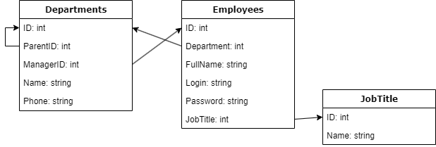

# Легенда

Есть исторические данные которые ранее хранились в другой системе, Заказчик предоставил нам выгрузку данных в файлах TSV, теперь требуется их хранить в БД PostgreSQL 14 версии. 

**Нужна утилита импорта данных из файлов в БД.**  

Пример данных в каталоге [data](data/).

Текущая схема классов для использования из нашего приложения:  
  

## Дополнительные требования

1. Импорт данных производится из TSV (tab separated) файла. Данные могут быть частично некорректными (регистр символов, пробелы по краям и в середине), в этом случае требуется их базовая очистка.
2. Повторный импорт не должен дублировать записи (для подразделения - уникальный признак **"название подразделения + название его родителя"**, для сотрудника - **ФИО**, для должности - **название**), при этом по сотрудникам, если в данных повторного импорта есть изменения, например смена пароля или подразделения у сотрудника - записи обновляются с новыми значениями, а для подразделений может смениться руководитель.  
3. Возможна неограниченная вложенность подразделений, проверку на закольцованность не делать, доверяем исходным данным.  
4. При импорте не должно падать на битых записях, они пропускаются с сообщением в stderror.  
5. Допустимо добавлять дополнительные столбцы в БД.  
6. Настройки доступа в БД должны храниться в файле конфигурации.  
7. Учитывать возможные массовые загрузки до 50к сотрудников по подразделениям.  
8. Родительскими подразделениями в БД считаются те, у которых ParentID=0, нумерация ID начинается с 1.  
9. Допустимы подразделения без руководителя.  
10. Рекомендуемый инструментарий - LINQ, EF.  

# Итоговый результат

Режимы работы утилиты:  

1. Импорт. Утилите передаётся имя файла и тип импорта (подразделение/сотрудник/должность). После импорта в консоль выводится полное текущее состояние БД.  
2. Вывод. Просим утилиту вывести текущую структуру данных, вторым параметром можно передавать ID подразделения, тогда выводится только цепочка родительских подразделений (без сотрудников) до него, само подразделение и его сотрудники.  
   Названия параметров и формат вызова - полностью на усмотрение разработчика.

# Требования по выводу

1. Подразделения выводятся по алфавиту с соблюдением иерархии
2. Префикс подразделения "=", их количество отражает уровень вложенности
3. Руководитель подразделения выводится с префиксом "*", перед ним количество " " = уровню вложенности подразделения
4. Сотрудники выводятся после подразделения с префиксом "-", перед ним количество " " = уровню вложенности подразделения, в котором они состоят)

Пример:

```
= Подразделение ID=1
* Сотрудник ID=1 (должность ID=56)
- Сотрудник ID=2 (должность)
== Подразделение ID=2
=== Подразделение ID=4
  - Сотрудник ID=5
== Подразделение ID=3
```

# Отчет о работе

1. C# проект с исходными кодами (ссылка на репозиторий).  
2. SQL скрипт для создания структуры БД (если требуется).  
3. Краткая инструкция - как запускать, как настроить.  
4. Дополнительные вопросы и предложения, если возникли в процессе реализации.  
